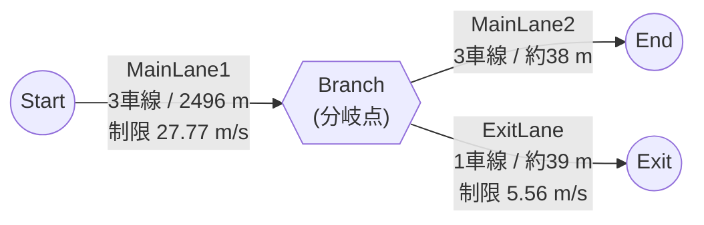
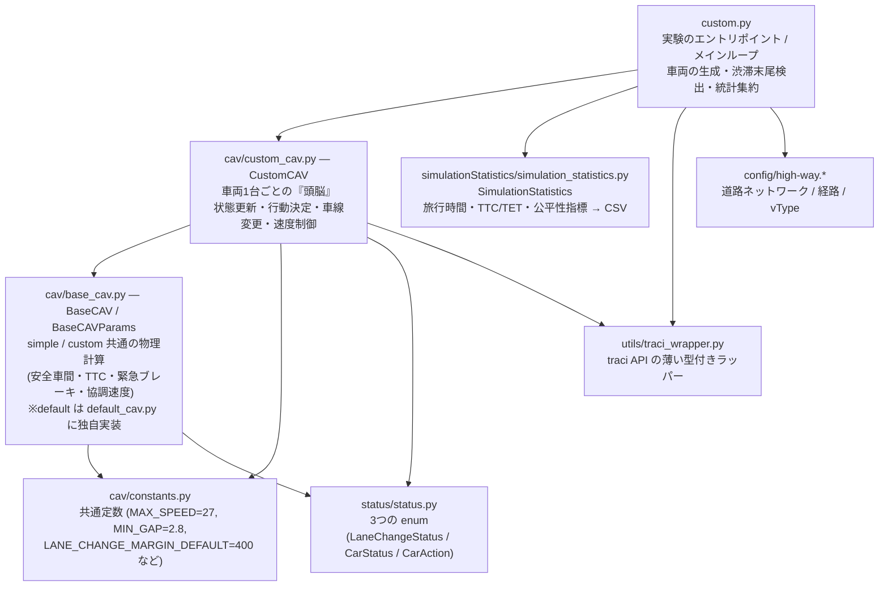
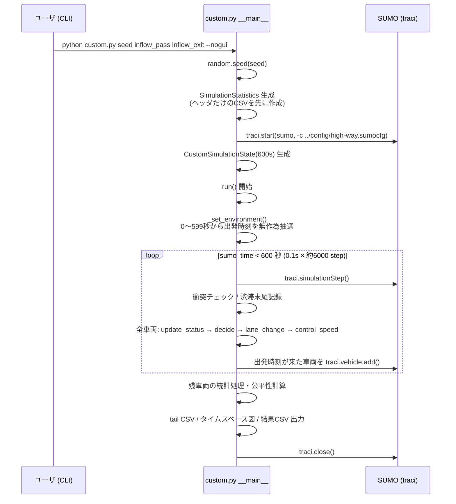
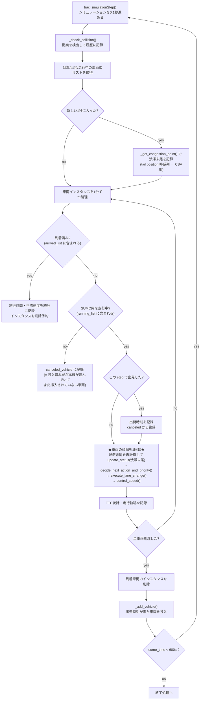
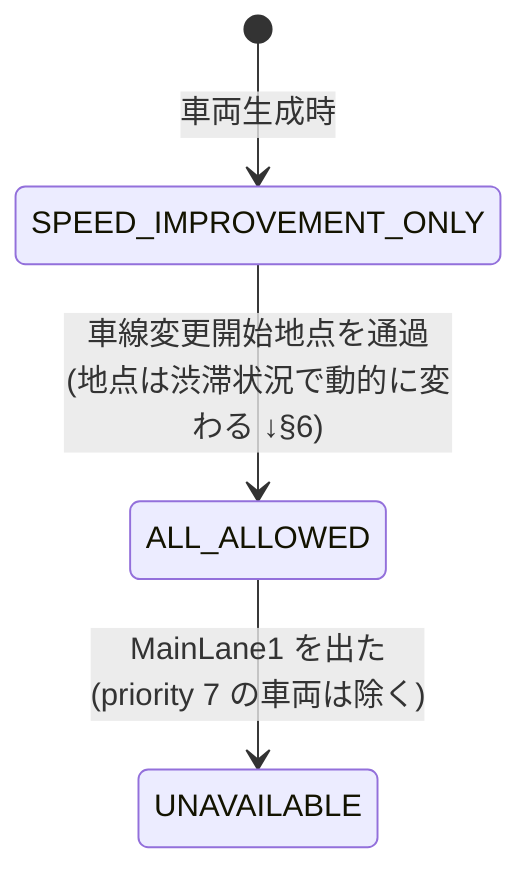
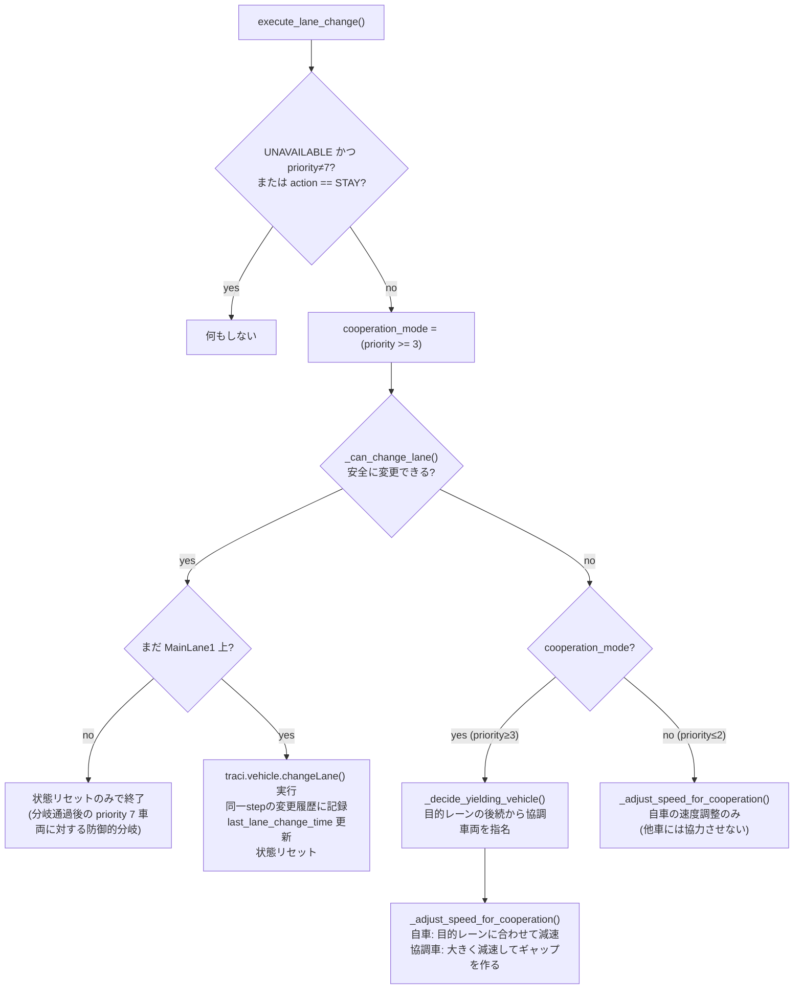
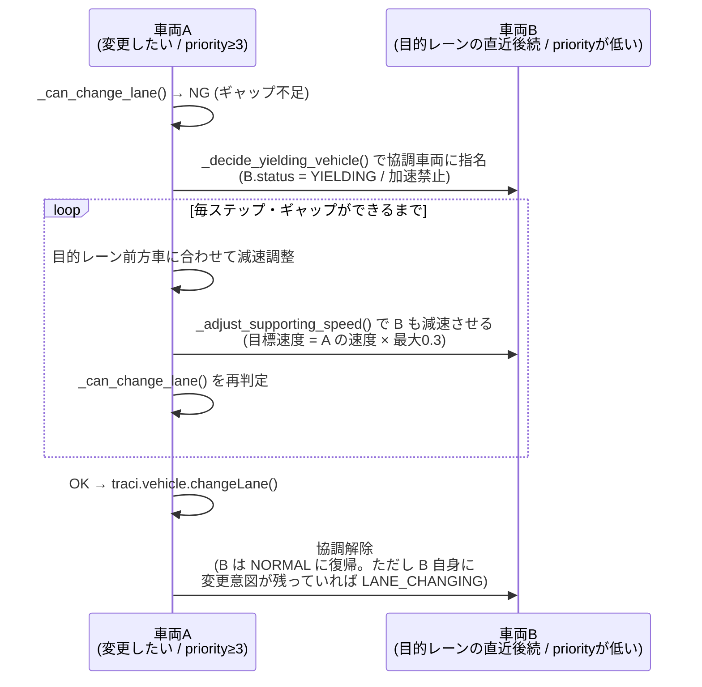
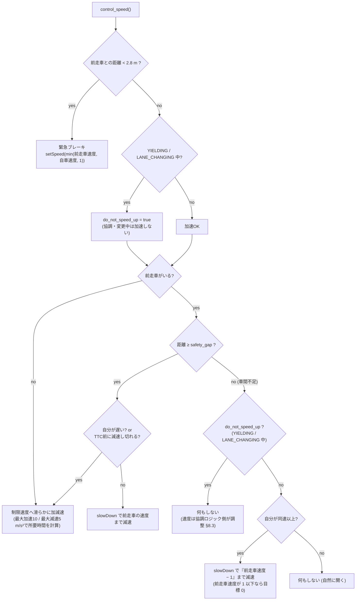

# `TraCI/custom.py` 挙動解説 — 提案モデル（車線変更開始位置の動的決定 & 優先度付き車線変更）

> 初めてこのコードを読む人向けに、`custom.py` の挙動を上から順に解説するドキュメント。
> 行番号は 2026-06 時点の `main` ブランチに基づく。

---

## 0. これは何のプログラムか

交通シミュレータ **SUMO** を **TraCI**（Python API）で外部制御する研究用スクリプトのひとつ。
「高速道路の分岐部で、流出車両（出口に向かう車）と通過車両が混在すると渋滞・危険が発生する」という問題に対し、リポジトリには 3 つの実験モデルがある:

| スクリプト | 位置づけ | 車線変更開始位置 | 優先度 |
|---|---|---|---|
| `TraCI/default.py` | SUMO 標準挙動 | 固定 2100 m 以降は SUMO に委譲 | なし |
| `TraCI/simple.py` | 比較対象モデル | **固定**（2100 m） | なし |
| `TraCI/custom.py` | **提案モデル（本ドキュメント）** | **動的**（渋滞末尾に応じて前倒し） | **あり（0〜7）** |

`custom.py` の提案の核心は 2 つ（`custom.py:1-3` の docstring 通り）:

1. **車線変更開始位置の動的決定** — 出口車線（lane 2）の渋滞末尾を毎ステップ検出し、渋滞が伸びていたら「車線変更してよい区間」を渋滞末尾より手前（上流）に動的に広げる
2. **車線変更への優先度付与** — 「どの車線にいる・どの経路の車両か」で車線変更に優先度（0〜7）を付け、優先度の高い車両は後続車に **協調（減速して譲ってもらう）** を要求できる

### 実行方法

```bash
cd TraCI
python custom.py <seed> <inflow_pass> <inflow_exit> [--nogui]
# 例: python custom.py 1 3000 600 --nogui
```

- `seed`: 乱数シード（文字列のまま `random.seed()` に渡る。`"1"` のときだけタイムスペース図 PNG を出力）
- `inflow_pass` / `inflow_exit`: 通過車 / 流出車の流入量 [台/h]
- 設定ファイルを `../config/high-way.sumocfg` と相対参照する（`custom.py:213`）ため、**`TraCI/` ディレクトリから実行する必要がある**
- 前提: SUMO がインストール済みで環境変数 `SUMO_HOME` が設定されていること（未設定だと import 時点で `sys.exit` する。`custom_cav.py:30-34`）

---

## 1. シミュレーションの舞台（道路ネットワーク）

`config/high-way.net.xml` で定義。本線 3 車線が分岐点 `Branch` で「本線継続」と「出口」に分かれる。



車線レベルで見ると、**出口（ExitLane）に接続しているのは lane 2（いちばん左の車線）だけ**（`high-way.net.xml:75`）:

```text
進行方向 →                                            分岐点 Branch
 ┌─────────────────────────────────────────────────┬──────────────┐
 │ lane 2 (最も左) ════════════════════════════════╪═→ MainLane2_2
 │                                                  └─→ ExitLane ★出口はここからのみ
 │ lane 1 (中央)   ════════════════════════════════════→ MainLane2_1
 │ lane 0 (最も右) ════════════════════════════════════→ MainLane2_0
 └─────────────────────────────────────────────────┴──────────────┘
 0 m                                            約2500 m
```

経路は 2 種類（`high-way.rou.xml:10-11`）:

- **`r_pass`**（通過車）: `MainLane1 → MainLane2` — どの車線からでも直進できる
- **`r_exit`**（流出車）: `MainLane1 → ExitLane` — **分岐までに必ず lane 2 へ移っておく必要がある**

つまりこのシミュレーションの本質的な対立は:

- `r_exit` 車は lane 2 に**入りたい**（しかも ExitLane の制限速度は 5.56 m/s なので lane 2 の先頭は減速し、渋滞が後ろに伸びやすい）
- `r_pass` 車は渋滞する lane 2 から**出たい**

車両タイプは全車 `CAV`（`high-way.rou.xml:7`: accel=10.0, decel=5.0, maxSpeed=27 m/s, length=5 m）。シミュレーションは `step-length=0.1` 秒刻み（`high-way.sumocfg:15`）。

---

## 2. ファイル構成と役割分担



重要な前提: **SUMO の自動運転ロジックはほぼ全部止めてある**。`CustomCAV.__init__`（`custom_cav.py:61-64`）で

```python
traci.vehicle.setLaneChangeMode(vehID=..., laneChangeMode=0)  # SUMOの自動車線変更を無効化
traci.vehicle.setSpeedMode(vehID=..., speedMode=0)            # SUMOの安全速度制御を無効化
```

としているため、**車線変更も速度制御も衝突回避も、すべてこの Python コードの責任**で行われる（だからこそ衝突統計が評価指標として意味を持つ）。

車両インスタンスは 2 箇所で管理されている点に注意:

- `state.vehicle_instance: list[CustomCAV]`（`custom.py:34`）— メインループが回す用のリスト
- `vehicle_instances: Dict[str, CustomCAV]`（`custom_cav.py:41`）— **モジュールグローバルの辞書**。協調時に「他の車両インスタンスの状態を直接書き換える」ために使う

---

## 3. 起動から終了までの全体フロー



### 3.1 出発時刻の抽選 — `_set_environment()`（`custom.py:217-228`）

```python
k_pass = int((600 / 3600) * inflow_pass)   # 例: inflow_pass=3000 → 600秒間に500台
state.departTime_r_pass = sorted(random.sample(range(600), k_pass))
state.departTime_r_pass = [round(n, 1) + 0.1 for n in state.departTime_r_pass]
```

- 0〜599 の整数秒から重複なしで `k` 個サンプリング（`random.sample` なので同一経路内では最低 1 秒間隔が保証される。コードコメントの「1秒以上間隔を確保」はこれを指す）
- 各時刻に `+0.1` して「x.1 秒」に出発させる。投入判定は `sumo_time in departTime_r_pass` という **float の等値比較**（`custom.py:333`）なので、この値は 0.1 秒刻みのシミュレーション時刻と正確に一致している必要がある
- `r_pass` と `r_exit` は別々に抽選するので、**同じ step に 2 台（各経路 1 台ずつ）投入されることはあり得る**

### 3.2 車両の投入 — `_add_vehicle()`（`custom.py:330-372`）と出発レーン選択

毎 step の最後に「現在時刻が出発予定時刻リストに入っているか」を見て `traci.vehicle.add()` する。
投入レーンは `_get_depart_lane()`（`custom.py:278-293`）が決める:

1. 各レーンの**挿入待ち行列**（`lane0_queue`〜`lane2_queue`）を見る
2. 待ちゼロのレーンがあればそこからランダム選択
3. 全レーンに待ちがあれば、最小の待ち数のレーンからランダム選択

投入された車両はまず待ち行列に積まれ、SUMO 内で実際に走り出した step で行列から外される（`_update_lane_queue`、`custom.py:269-275`）。
車両 ID は `0, 1, 2, ...` の連番文字列で、同時に `CustomCAV` インスタンスが生成される。

---

## 4. メインループ — 0.1 秒ごとに起きること（`run()`、`custom.py:51-209`）



1 台の車両は毎 step、必ずこの 4 メソッドをこの順で実行する（`custom.py:133-136`）:

| 順 | メソッド | 役割 |
|---|---|---|
| 1 | `update_status(congestion_point)` | TraCI から位置・速度・前走車などを取得して自分の状態を更新。LaneChangeStatus の遷移、緊急優先度 7 の判定もここ |
| 2 | `decide_next_action_and_priority()` | ルールテーブルから「今やるべき行動（STAY / 左へ / 右へ）」と優先度を決める |
| 3 | `execute_lane_change(history)` | 安全なら車線変更を実行。できなければ協調（後続に譲ってもらう）を試みる |
| 4 | `control_speed()` | 前走車との車間・TTC に基づく速度制御（追従・減速・緊急ブレーキ） |

---

## 5. 車両の状態モデル — 3 つの enum（`status/status.py`）

### LaneChangeStatus — 「いまどんな車線変更が許可されているか」



| 状態 | 意味 |
|---|---|
| `SPEED_IMPROVEMENT_ONLY` | 初期状態。**速度向上目的の車線変更だけ**許可（経路目的の変更はまだ禁止） |
| `ALL_ALLOWED` | 車線変更開始地点を通過後。経路目的（出口へ寄る等）の変更も許可 |
| `UNAVAILABLE` | 分岐を過ぎて `MainLane2` / `ExitLane` に入った後。原則車線変更禁止 |

### CarStatus — 「いま何をしているか」

| 状態 | 意味 |
|---|---|
| `NORMAL` | 通常走行 |
| `LANE_CHANGING` | 車線変更しようとしている（ギャップ待ち含む） |
| `YIELDING` | **他車の車線変更のために減速して譲っている**（協調の受け側） |

### CarAction — 「次の行動」

`STAY`（車線維持）/ `CHANGE_LEFT`（左へ = lane index +1）/ `CHANGE_RIGHT`（右へ = lane index −1）

---

## 6. 提案① 車線変更開始位置の動的決定

### 6.1 渋滞末尾の検出 — `_get_congestion_point()`（`custom.py:296-316`）

毎 step、出口車線 `MainLane1_2` だけを調べる:

1. lane 2 上の車両が 5 台未満なら「渋滞なし」→ `2500`（= 分岐位置）を返す
2. 車両を位置の前（分岐側）から後ろへ並べ、**速度 11.1 m/s（40 km/h）以下が 5 台以上連続**する塊（プラトーン）を探す
3. 見つかったら、その塊の**いちばん後ろ（上流側）の車両の位置 = 渋滞末尾（tail position）**を返す
4. 速い車が挟まると連続カウントはリセット。複数の塊があれば**最も上流側の塊の末尾**が採用される

この関数は 2 つの用途で呼ばれる: (a) 1 秒ごとの記録用（tail position CSV、`custom.py:83-89`）、(b) **車両 1 台ごと・毎 step の状態更新用**（`custom.py:132`）。つまり次節の動的開始地点の判定には、キャッシュではなく常に最新の渋滞末尾が使われる（その分、毎 step 車両数だけ TraCI クエリが走る）。

### 6.2 開始地点の決定 — `_has_passed_lane_change_point()`（`custom_cav.py:482-495`）

```text
                              通常時: 分岐の400m手前から解禁
─────────────────────────────●━━━━━━━━━━━━━━━━━━━━━━━━│分岐
0m                         2100m                    2500m

      渋滞時: 渋滞末尾(tail)の 70m 手前から解禁（前倒し）
──────────────●━━━━━━[tail ≦2170m]≈≈≈渋滞≈≈≈│分岐
           tail−70m
```

```python
if congestion_point is None or congestion_point > 2170:   # 2500 - 400 + 70
    merge_start_pos = 2100                                # 通常: 2500 - 400
else:
    merge_start_pos = congestion_point - 70               # 渋滞時: 末尾の70m手前
return current_pos > merge_start_pos
```

- 通常時の解禁地点は `MAINLANE_LENGTH(2500) − LANE_CHANGE_MARGIN_DEFAULT(400) = 2100 m`
- lane 2 の渋滞末尾が 2170 m より上流まで伸びてきたら、解禁地点を **渋滞末尾 − 70 m**（`LANE_CHANGE_MARGIN_CONGESTED`、`custom_cav.py:38`）に前倒しする
- つまり「渋滞の最後尾に到達する前に、流出車が余裕をもって lane 2 側へ寄り始められる」ようにするのが狙い。渋滞が伸びるほど解禁地点も上流へ動く（**動的決定**）

この地点を通過した瞬間に `SPEED_IMPROVEMENT_ONLY → ALL_ALLOWED` へ遷移する（`custom_cav.py:197-201`）。

> 比較: `simple` モデルの解禁地点は常に固定 2100 m。さらに lane 2 の渋滞末尾が 2100 m より上流まで伸びた場合、lane 1 の `r_exit` 車は分岐 120 m 手前（2380 m）に達するまで**協調（後続に譲ってもらう）による割り込みを保留**する（自力で入れるギャップがあれば変更自体はいつでも実行する。`simple_cav.py:416-436`）。custom は逆に、渋滞時ほど開始地点そのものを上流へ前倒しして早く寄り始めさせる。

---

## 7. 提案② 優先度テーブルと行動決定

### 7.1 ルールテーブル（`custom_cav.py:67-158`）

行動は「(現在レーン, キー) → ルール」の辞書で決まる。条件をすべて満たすとそのルールの action / priority が採用される:

| 現在レーン | キー | 参照される LC 状態 | 追加条件 | action | priority |
|---|---|---|---|---|---|
| 2 | `speed` | SPEED_IMPROVEMENT_ONLY | 右で速度向上見込み | CHANGE_RIGHT | 0 |
| 2 | `r_exit` | ALL_ALLOWED | なし | **STAY** | 1 |
| 2 | `r_pass` | ALL_ALLOWED | 右で速度向上見込み | CHANGE_RIGHT | 3 |
| 1 | `speed_left` | SPEED_IMPROVEMENT_ONLY | 左で速度向上見込み | CHANGE_LEFT | 0 |
| 1 | `speed_right` | SPEED_IMPROVEMENT_ONLY | 右で速度向上見込み | CHANGE_RIGHT | 0 |
| 1 | `r_exit` | ALL_ALLOWED | なし | CHANGE_LEFT | 5 |
| 1 | `r_pass_left` | ALL_ALLOWED | 左で速度向上見込み | CHANGE_LEFT | 2 |
| 1 | `r_pass_right` | ALL_ALLOWED | 右で速度向上見込み | CHANGE_RIGHT | 4 |
| 0 | `speed` | SPEED_IMPROVEMENT_ONLY | 左で速度向上見込み | CHANGE_LEFT | 0 |
| 0 | `r_exit` | ALL_ALLOWED | なし | CHANGE_LEFT | 6 |
| 0 | `r_pass` | ALL_ALLOWED | 左で速度向上見込み | CHANGE_LEFT | 2 |

キーの選び方（`decide_next_action_and_priority()`、`custom_cav.py:248-326`）:

- `SPEED_IMPROVEMENT_ONLY` 中 → **経路に関係なく** `speed` 系キーを参照（= 解禁地点より手前では全車「速くなるなら変更してよい」だけ）
- `ALL_ALLOWED` 中 → `(レーン, 経路)` キーを参照（= 経路目的の変更が解禁される）
- 該当ルールがない / 条件不成立 → `STAY` / priority 0
- すでに `LANE_CHANGING` / `YIELDING` 中（ALL_ALLOWED 時）→ 行動を変えずに継続（`custom_cav.py:256-259`）

### 7.2 優先度の意味（大きいほど強い）

| priority | 誰に付くか | 意図 |
|---|---|---|
| **7** | 分岐 50 m 手前で**まだ lane 2 にいない `r_exit` 車**（`update_status` で強制付与、`custom_cav.py:187-191`） | 緊急。クールダウンも UNAVAILABLE も無視して左へ寄り続ける |
| **6** | lane 0 の `r_exit`（あと 2 回変更が必要） | 流出車の経路達成が最優先 |
| **5** | lane 1 の `r_exit`（あと 1 回） | 同上 |
| **4** | lane 1 の `r_pass` が右へ | 通過車を lane 0 側へ逃がし、lane 1 を流出車の通り道として空ける |
| **3** | lane 2 の `r_pass` が右へ | 渋滞しがちな出口車線から通過車を退避させる |
| **2** | lane 0/1 の `r_pass` が左へ | 単なる速度向上目的（解禁後） |
| **1** | lane 2 の `r_exit`（STAY） | 出口車線を維持。実装上は STAY なので車線変更には使われず、譲る側の選定でも priority 0 と実質同じ扱い（協調を要求できるのは priority ≥ 3 のみ）。priority ≥ 3 の車からは譲る側に指名され得る |
| **0** | それ以外すべて | 解禁前の速度向上変更・行動なし |

### 7.3 速度向上の見込み判定 — `_is_predicted_speed_increase()`（`custom_cav.py:709-731`）

「隣レーンに移ったら速くなるか」の予測:

```text
目的レーンの前方車の平均速度 > max(自車速度, 現レーン前方車の平均速度) × 1.4
```

- 閾値は `SPEED_IMPROVEMENT_THRESHOLD = 40 %`（`constants.py:16`）— **40 % 以上**速くなる見込みがないと動かない
- 現レーンに前方車がいなければ `False`（移る理由がない）、目的レーンに前方車がいなければ `True`

### 7.4 連続車線変更の抑制（クールダウン、`custom_cav.py:314-326`）

直前の車線変更からの経過時間で、新しい車線変更を却下する:

- priority 5 以上（= 流出車の経路変更）: **1 秒**
- priority 4 以下: **10 秒**
- priority 7: クールダウン免除

---

## 8. 車線変更の実行と協調 — `execute_lane_change()`（`custom_cav.py:387-428`）

### 8.1 全体の流れ



ポイント: **priority 3 以上（= 経路目的の変更）だけが他車に協調を要求できる**。priority 0〜2 の速度向上目的の変更は、自力でギャップが見つかるまで待つしかない。

### 8.2 安全チェック — `_can_change_lane()`（`custom_cav.py:623-705`）

4 種類のチェックをすべて通ると変更可:

1. **同一 step の競合回避**: この step で既に同じレーンへ変更した車両が ±(車長 5 + MIN_GAP 2.8 = 7.8 m) 以内にいないか（`lane_change_history` 辞書で管理）
2. **対向同時進入の回避**: lane 0 と lane 2 から**同時に lane 1 へ**入ろうとする車両同士の衝突予防。相手が変更意思あり・かつ自分以上の優先度なら見送る（ここでも優先度が効く）
3. **目的レーンの後続車とのギャップ**: 必要距離 = `車長 + MIN_GAP×1.5 (= 9.2 m)`、後続が自分より速い場合は後続の安全制動距離を速度差に応じて加算
4. **目的レーンの先行車とのギャップ**: 同様（自分が速い場合に自分の制動距離を加算）

3・4 で不足した場合は「現在距離 / 必要距離 / 先行車速度」を記録して `False` を返す — この値が次の協調減速の計算に使われる。

### 8.3 協調（譲り合い）のしくみ



協調車両の選び方（`_decide_yielding_vehicle()`、`custom_cav.py:556-611`）:

- 候補 = 目的レーンの後続車のうち、**自分より priority が低く**、`NORMAL` か `LANE_CHANGING` の車両
- 基本は最も近い車両を指名（自車が停止中のときは 2 番目に近い車両）
- 指名された車両は `YIELDING` になり、`control_speed` での加速が禁止され、毎 step 要求側から速度を直接調整される（`_adjust_supporting_speed`、`base_cav.py:119-136`）
- 譲る側の目標速度は `要求側の速度 × min((必要距離−現在距離)/必要距離, 0.3)`（`base_cav.py:138-148`）— つまり**要求側の 3 割以下まで**しっかり減速してギャップを作る

`update_status` には協調ペアの整合性チェック（同一レーンになってしまった等で警告を出して解消する）もある（`custom_cav.py:219-246`）。

---

## 9. 速度制御 — `control_speed()`（`custom_cav.py:328-385`）

SUMO の安全制御を切っているので、追突回避はすべてここで行う。

### 9.1 安全車間距離（`base_cav.py:76-84`）

```text
safety_gap = 空走距離 + 制動距離 + MIN_GAP
           = v × 0.75s + (3.6v)² / (254.016 × 0.7) + 2.8m
```

（反応時間 0.75 s、摩擦係数 0.7 の停止距離モデル）

### 9.2 制御フロー



- `TTC = 車間距離 ÷ 速度差`（接近中のみ。`base_cav.py:106-110`）
- 緊急ブレーキは `traci.vehicle.setSpeed`（即時設定）、通常の加減速は `traci.vehicle.slowDown`（目標速度まで指定時間で変化）を使い分けている

---

## 10. 統計と出力ファイル

すべて `TraCI/simulationStatistics/statistics/custom/` 配下に出力される（実行時の cwd 基準の相対パス）。

| 出力 | 中身 | 生成箇所 |
|---|---|---|
| `custom_pass{p}_exit{e}_seed{s}_{タイムスタンプ}.csv` | 実験 1 回 = 1 行のサマリ CSV（下記指標） | `SimulationStatistics.add_result`（`simulation_statistics.py:150-192`） |
| `tail_positions_pass{p}_exit{e}_seed{s}.csv` | 1 秒ごとの渋滞末尾位置の時系列（`tail_pos = 2500 − congestion_point`、分岐からの距離） | `custom.py:180-188` |
| `custom_{p}_{e}_lane{0,1,2}_time_space_diagram.png` | レーン別タイムスペース図（**seed が `"1"` のときだけ**） | `custom.py:388-410` |

サマリ CSV の主な指標:

| 指標 | 意味 |
|---|---|
| `average_travel_time`（全体 / r_pass / r_exit 別） | 出発→到着の平均所要時間 |
| `average_speed`（同上） | 車両ごとの平均速度のさらに平均 |
| `min_TTC` / `TET` | 安全性。TTC < 2.0 s だった時間の累積が TET（1 判定につき +0.1 s、`simulation_statistics.py:93-107`） |
| `total_collisions` / `total_vehicles_involved` | 衝突イベント数と関与台数（`_check_collision`、`custom.py:257-266`。同一車両集合の 1 秒以内の再検出は重複排除） |
| `overtaking_count` / `overtaking_vehicle_count` / `fairness_index` | r_exit 車の「出発順」と「到着順（600 s 時点で走行中の車は分岐に近い順で末尾に連結）」を比較し、順位を上げた車両の前進量の合計が `overtaking_count`、その車両数が `overtaking_vehicle_count`、1 台あたり平均が `fairness_index`（`simulation_statistics.py:71-91`） |
| `max_tail_position` | 渋滞末尾が分岐から最大何 m まで伸びたか |
| `canceled_vehicles` | 本線が詰まって最後まで挿入できなかった車両数（衝突関与車を除く） |
| `traffic volume` | 実際に出発できた台数の時間換算 [pcu/h] |

600 秒終了時にまだ走行中だった車両の扱いは指標ごとに異なる: **旅行時間には含まれない**（到着車のみ）、**平均速度には含まれる**（`custom.py:156-164`）、r_exit 車は位置順で「到着順」リストに連結され**公平性計算に含まれる**。

---

## 11. 3 モデルの比較まとめ

| 観点 | default | simple | **custom（提案）** |
|---|---|---|---|
| 車線変更の実行主体 | SUMO 標準モデル（2100 m 通過後にモード解禁するだけ） | 自前ロジックで `changeLane` | 自前ロジックで `changeLane` |
| 車線変更開始位置 | 固定 2100 m | 固定 2100 m（lane 2 渋滞時、lane 1 の r_exit は**協調による割り込みのみ**分岐 120 m 手前まで保留） | **渋滞末尾 − 70 m へ動的に前倒し**（通常時 2100 m） |
| 優先度 | 概念なし | ルール上は全部 0（間に合わない流出車のみ緊急値 1） | **0〜7 の優先度**。譲る相手の選定・同時進入の調停・クールダウン長に使用 |
| 協調（譲り） | なし | あり（優先度によるフィルタなし） | あり（**自分より低い優先度の車だけ**に譲らせる。priority ≥ 3 のみ要求可） |
| 速度制御 | 制限速度超過時の減速のみ | TTC・安全車間ベースの自前制御 | simple と同系の自前制御 |

---

## 12. 初見でハマりやすいポイント

1. **SUMO まかせの挙動はない** — `laneChangeMode=0` / `speedMode=0` なので、SUMO 標準の追従・衝突回避は無効。衝突が起きるのは Python 側ロジックの帰結
2. **`vehicle_instances`（モジュールグローバル辞書）** — 協調では要求側が相手インスタンスの `status` や速度を**直接**書き換える。`custom.py` 側の `state.vehicle_instance`（リスト）とは別物
3. **`canceled_vehicle` は「キャンセル」ではない** — `traci.vehicle.add` 済みだが本線が混んでいて SUMO がまだ挿入できていない車両。後で出発したらリストから外れる。最後まで残った車両だけが統計上の「未投入」
4. **`seed` のグローバル参照** — `_record_lane_data` / `_plot_time_space_diagram`（`custom.py:375-410`）は `__main__` で定義されたグローバル変数 `seed` を直接参照している。モジュールとして import して `run()` を呼ぶと `NameError` になり得る
5. **出発時刻の照合は float の等値比較** — `if sumo_time in state.departTime_r_pass:`（`custom.py:333`）。step 長 0.1 s と「x.1 秒」の出発時刻が一致する前提の実装
6. **`MAINLANE_LENGTH = 2500` は公称値** — 実際のネットワーク上のレーン長は 2496 m（`high-way.net.xml:51-55`）。判定はすべて公称値ベース
7. **渋滞判定はあくまで lane 2 のみ**（`MainLane1_2`）。lane 0/1 がどれだけ詰まっても `congestion_point` には影響しない
8. **同一 step 内の変更競合は `lane_change_history` で調停** — 各 step の先に処理された車両が勝つ（インスタンスリスト順 = 生成順 = おおむね上流ほど後）
9. **衝突時刻は `getTime() − 0.1`** — `simulationStep()` 直後に検出するため、「直前の step で起きた」として記録される（`custom.py:260`）
10. **シミュレーション時間は 600 秒固定**（`SIMULATION_TIME`、`custom.py:21`）だが、sumocfg の `end=6000` とは無関係（ループ側の条件で 600 秒で `traci.close()` する）
